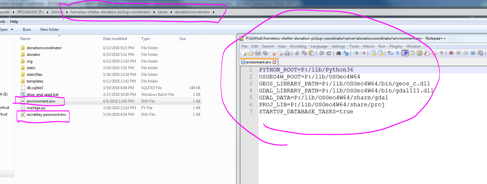
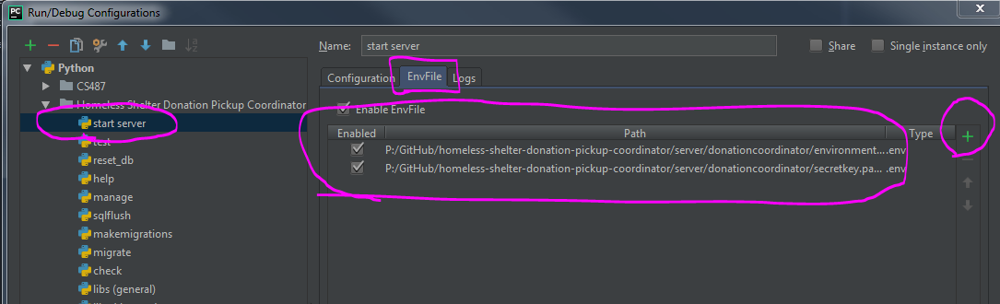
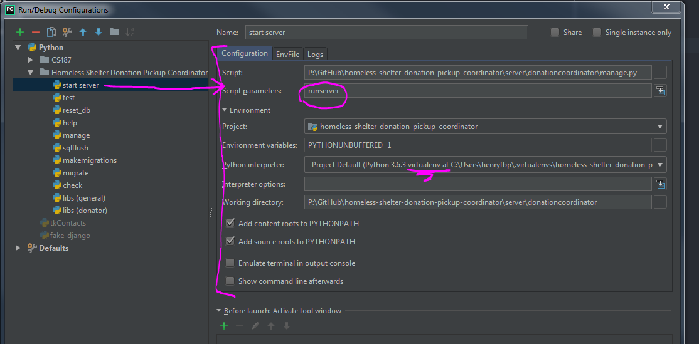

<!-- TOC depthFrom:1 depthTo:6 withLinks:1 updateOnSave:1 orderedList:0 -->

- [Other pages](#other-pages)
- [For those who dislike reading or have little time](#for-those-who-dislike-reading-or-have-little-time)
- [For donaters](#for-donaters)
- [For shelters](#for-shelters)
- [For developers](#for-developers)
	- [Basic libraries](#basic-libraries)
	- [Environment variables](#environment-variables)
		- [Required](#required)
		- [Optional (in my experience)](#optional-in-my-experience)
	- [Database tasks](#database-tasks)
	- [Everything is broken and awful! AAAAAHHHH!](#everything-is-broken-and-awful-aaaaahhhh)
	- [Other important Notes](#other-important-notes)

<!-- /TOC -->

App built from `release` branch is available here:
https://shelter-pickup-coordinator.herokuapp.com/

This application will (once developed) help to coordinate picking up
to-be-donated goods from people who wish to donate them.

It will achieve this by letting donaters and shelters essentially cooperate with
each other over this platform.

# Other pages
- [Sketches](_sketches)
- [Reflection about this app](_notes/reflection.md)
- [Notes on shelters](_notes)

# For those who dislike reading or have little time
- Working on an application for a comms course at IIT
- Will coordinate picking up donated goods from civilians:
  - Lets donaters publish their location and what they will donate publicly to various organizations
  - When pickup vehicle is collecting, their route (can be) visible to those who want to donate
  - Lets orgs plan routes based off of available donations
  - Donaters can see what organizations need which items

# For donaters
- List what items they wish to donate
- Publish their location to homeless shelters as to optimize the collection
  routes of pickup vehicles
- See **which shelters**; **where**; need **what** items 
- Get notified of pickup routes
  - If a route does not intersect with you, is there another dropoff point
  nearby?
  
# For shelters
- Publicly display needed items
- See all people who have things to donate
- Plan routes based off of customizable criteria:
  - Distance
  - Needed items
  - Statistics! (possibly)
    - Best geo-locations for most items?
      - Of a specfic class?
    - See item-yield of routes as statistics
    - Heatmap of item density?
  - By item group
    - Clothing
      - Winter clothes
      - Summer clothes
    - Food
      - Canned food
      - Produce

# For developers

## Basic libraries

To develop or contribute for this project, you will need the following:
- [Python >= 3.6](https://www.python.org/downloads/)
  - pipenv (a virtual environment manager for Python)
  - See `Pipfile` for details
  - `pipenv install`
- PostGreSQL
- [Geospatial libraries](https://docs.djangoproject.com/en/2.0/ref/contrib/gis/install/geolibs/)
  - PostGIS
  - GEOS
  - GDAL
  - PROJ.4

## Environment variables

### Required

- `PYTHON_ROOT` = `C:\Program Files\Python3.6\`
  - Where your Python installation lives.
  - Essential for running Python programs.

- `SECRET_KEY` = [`a constant key used to sign cryptographic information`](https://docs.djangoproject.com/en/dev/ref/settings/#secret-key).
  - Keep it safe and don't tell anyone it.
  - Make sure NOT to print it out once in 'production mode'
  - Changing this key will invalidate all of the following if made using a prior key:
    - Sessions
    - CookieStorage or FallbackStorage
    - PasswordResetView tokens
    - Any usage of cryptographic signing

- `OSGEO4W_ROOT` = `C:\OSGeo4W64\`
  - Where GEOS, GDAL, PostGIS, PROJ.4 live. 
  - Essential for `PostGIS` to work with `PostGreSQL`.
  - Without it, we cannot use `Point` or `Geometry` and cannot store Geolocation data.

- `GEOPOSITION_GOOGLE_MAPS_API_KEY` = [`go get one from google!`](https://developers.google.com/maps/)
  - Used to turn addresses into `(lat,lon)` tuples
  - Used to embed pretty little maps

### Optional (in my experience)

- `STARTUP_DATABASE_TASKS` = `true | false`
  - Whether or not to destroy all data in the database and replace it with test data.
  - It is `false` by default, i.e. your database doesn't get reset by default.

- `DJANGO_SETTINGS_MODULE` = `donationcoordinator.settings`
  - The place where a bunch of constant vars live.

- `GEOS_LIBRARY_PATH` = `P:/lib/OSGeo4W64/bin/geos_c.dll`
  - Where the GEOS library lives, whatever that is.

- `GDAL_LIBRARY_PATH` = `P:/lib/OSGeo4W64/bin/gdal111.dll`
  - Where the GDAL library lives, whatever that is.

- `GDAL_DATA` = `P:/lib/OSGeo4W64/share/gdal`
  - Your guess is as good as mine. (I don't know.)

- `PROJ_LIB` = `P:/lib/OSGeo4W64/share/proj`
  - Also don't know.

## Database tasks

Because of the way Django handles database ORM, you will need to run these commands to migrate the objects into SQL schemas:
- `py manage.py makemigrations`
- `py manage.py migrate`

To run, simply type `py manage.py runserver`.

## Everything is broken and awful! AAAAAHHHH!

If you get super stuck on something, either:

- Look at these files:
  - `Procfile`, it contains the deployment instructions for Heroku,
  - `Profile.windows`, it contains some really old but possibly helpful deployment instructions for windowsx
  - `.travis.yml`, it contains the test-case setup commands and some SQL,
  - The [travis build logs](https://travis-ci.org/HenryFBP/homeless-shelter-donation-pickup-coordinator/builds), which contain all sorts of debug goodness,
- Email me at \[my_github_name\]@gmail.com
- Contact Henry F.B. Post on facebook
- Contact me on Skype

## Other important Notes

- What IDE do you use?
  - I use [PyCharm](https://www.jetbrains.com/pycharm/). It's free and does what I need.  
  All I use it for that a text editor can't do is essentially refactoring, IntelliSense-like features, debugging tools, etc.
- How do you manage environment variables?  
  All these env vars seem annoying and I have to set them up every time/run a batch file to set them/etc.
  - I use a plugin for PyCharm called '[.env files support](https://plugins.jetbrains.com/plugin/9525--env-files-support)' that looks at any `.env` file and lets you run a Python program with those environment variables applied.  
  Here's an example of what the file looks like:
    
  This also explains why I have `.env` in my `.gitignore` file.  
  Here's what it looks like in the IDE settings:
    
- What does your run configuration look like?
  - This:  
    
  
