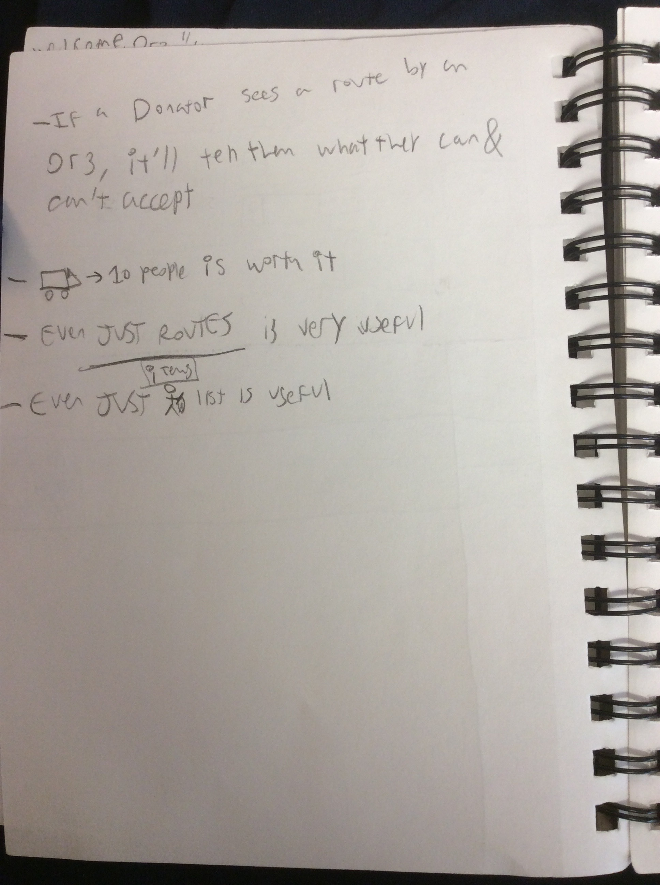
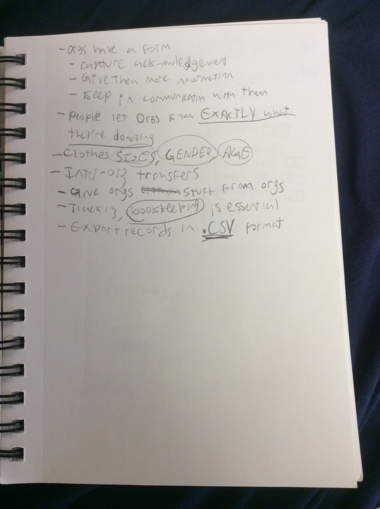
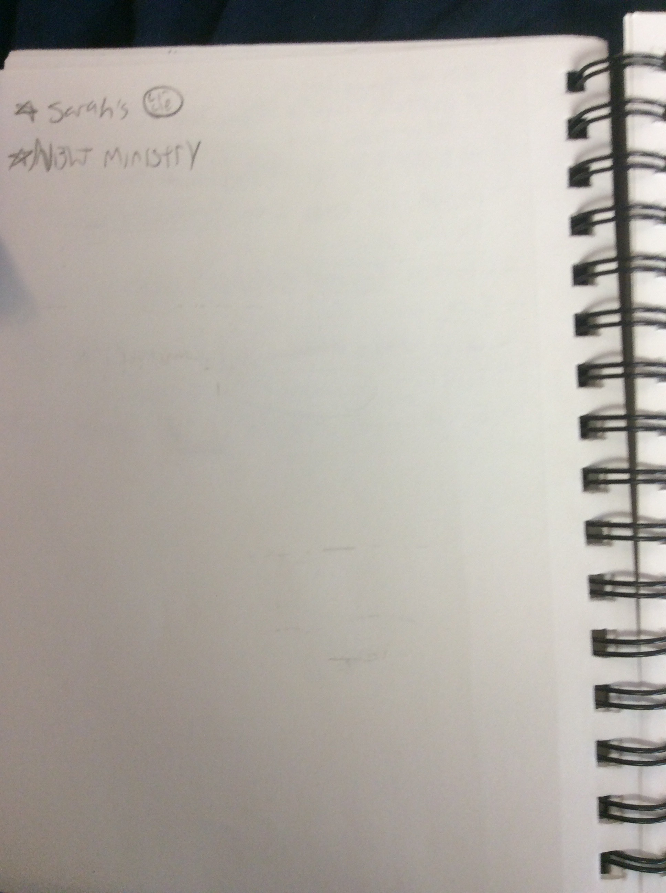

<!-- TOC depthFrom:1 depthTo:6 withLinks:1 updateOnSave:1 orderedList:0 -->

- [In general](#in-general)
- [Shelters I'm considering](#shelters-im-considering)
	- [North Side Housing and Supportive Services](#north-side-housing-and-supportive-services)
	- [Chicago Coalition for the Homeless](#chicago-coalition-for-the-homeless)
	- [Pacific Garden Mission (✝ Religious)](#pacific-garden-mission-religious)
	- [Sarah's Circle (♀)](#sarahs-circle-)
	- [Deborah's Place (♀)](#deborahs-place-)
	- [Lincoln Park Community Services](#lincoln-park-community-services)
	- [A Safe Haven](#a-safe-haven)
- [Shelters I've talked to](#shelters-ive-talked-to)
	- [Lincoln Park Community Services (03/11/2018)](#lincoln-park-community-services-03112018)
	- [North Side Housing and Supportive Services (03/12/2018)](#north-side-housing-and-supportive-services-03122018)
		- [Notes from 03/14/2018 discussion](#notes-from-03142018-discussion)

<!-- /TOC -->

# In general
I will choose shelters to interview based off of:

- Rating
  - Yelp
  - Google Maps Reviews
- Likelihood of:
  - Responding to my queries
  - Giving feedback, telling me what **they need** from me in terms of app dev
  - Co-operating in my app dev quest

Once (if) the app is finished, I will simply reach out to as many shelters as
possible and, as this app is free to use and distribute, offer them the usage of
the app.

There will be a Wiki that will tell both users and orgs how to use my
application, register themselves, put their stuff up, etc.

# Shelters I'm considering

## North Side Housing and Supportive Services
[(:link:) Link to site](http://www.northsidehousing.org/)
- 4.7 :star: s
- Hours:

| Day      | Time       |
| -------- | ---------- |
| M-F      | 9AM-5PM    |

## Chicago Coalition for the Homeless
[(:link:) Link to site](http://www.chicagohomeless.org/)
- 70 E Lake St, Chicago, IL 60601
- Hours:

| Day      | Time       |
| -------- | ---------- |
| M-F      | 9AM-5PM    |

- 4.6 :star: s, 11 reviews.

## Pacific Garden Mission (✝ Religious)
[(:link:) Link to site](https://www.pgm.org/)
- 1458 S. Canal Street, Chicago, IL 60607
- 3.6 :star: s, 211 reviews.
- Religious

## Sarah's Circle (♀)
[(:link:) Link to site](https://www.sarahs-circle.org/)
- 4838 N Sheridan Rd, Chicago, IL 60640
- Hours:

| Day      | Time       |
| -------- | ---------- |
| M        | 9AM-4:30PM |
| TU       | 9AM-7PM    |
| W,TH,F   | 9AM-4:30PM |

- 4.6 :star: s, 25 reviews.

## Deborah's Place (♀)
[(:link:) Link to site](http://www.deborahsplace.org/)
- 2822 W Jackson Blvd, Chicago, IL 60612
- Hours:

| Day      | Time       |
| -------- | ---------- |
| M-F      | 9AM-5PM    |

- 4.2 :star: s, 30 reviews.

## Lincoln Park Community Services
[(:link:) Link to site](https://lpcsonline.org/)
- 600 W Fullerton Pkwy, Chicago, IL 60614
- Hours:

| Day      | Time       |
| -------- | ---------- |
| All days | 9AM-8PM    |

- 4.6 :star: s, 34 reviews.

## A Safe Haven
[(:link:) Link to site](http://www.asafehaven.org/)
- 2750 W Roosevelt Rd, Chicago, IL 60608
- Hours:

| Day      | Time          |
| -------- | ------------- |
| M-F      | 8:30AM-5PM    |

- 3.7 :star: s, 28 reviews.

# Shelters I've talked to

## Lincoln Park Community Services (03/11/2018)
- 1st contact: 03/11/2018
  - Voicemail
  - Email
- No response yet.

## North Side Housing and Supportive Services (03/12/2018)
- 1st contact: 03/12/2018
  - Voicemail was full
  - Email
- Email response on 3/13/2018 
  - Reply from donation manager, may meet in-person or over the phone.
- Met in-person on 03/14/2018

### Notes from 03/14/2018 discussion

- Talked mainly about small yet important things that the app should do
  - Bookkeeping!
    - Export transaction logs as `csv`, `pdf`, `docx`, `txt`, etc
    - Sign-up form for users that Orgs can customize
    - Keep track of items that an Org has
  - Inter-organization transfers
  - Donators must let Orgs know EXACTLY what they're donating
    - i.e. men's underwear is essentially useless to Sarah's circle
- Other Orgs I should contact are:
  - [Sarah's Circle (♀)](#sarahs-circle-)
  - Night Ministry

- 
- 
- 
