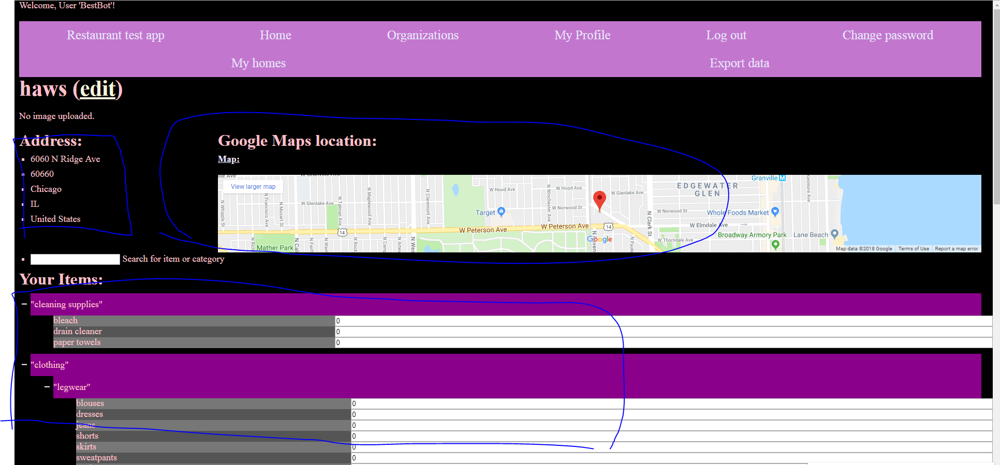
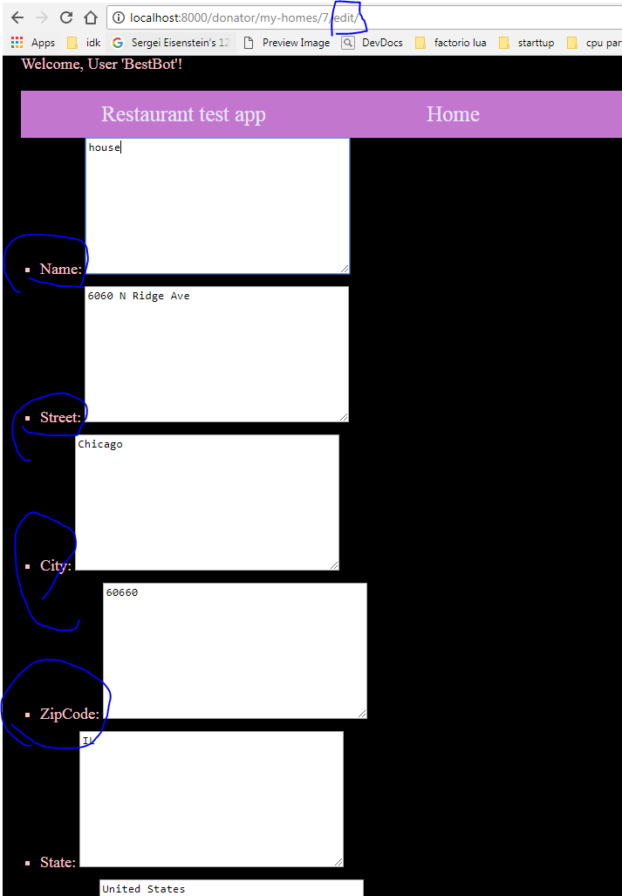
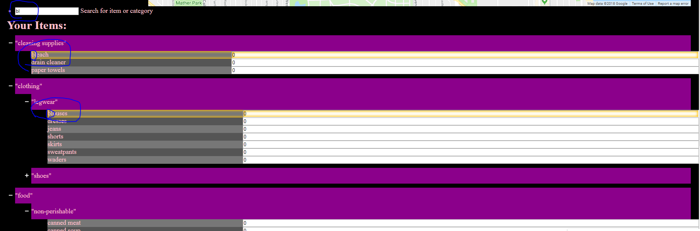
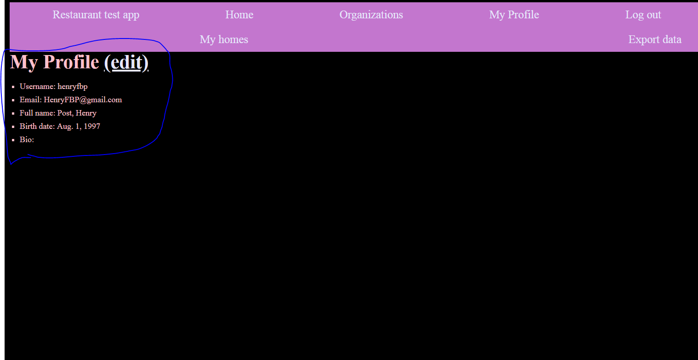
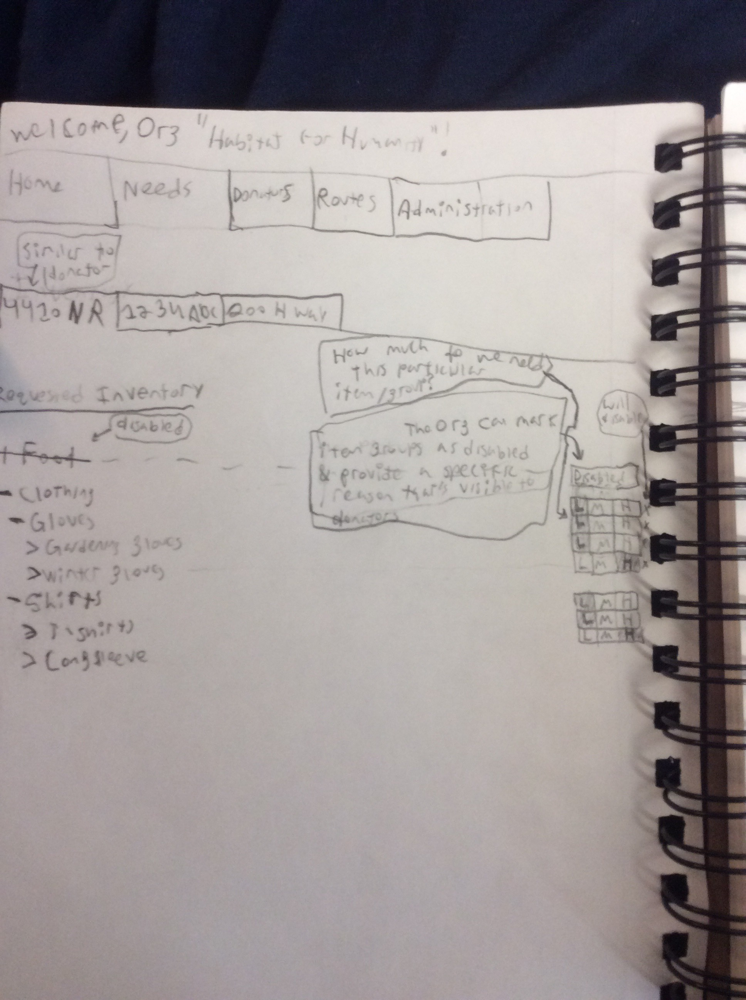
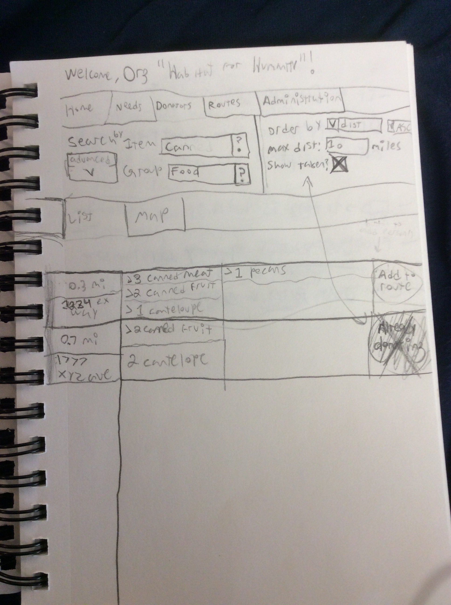
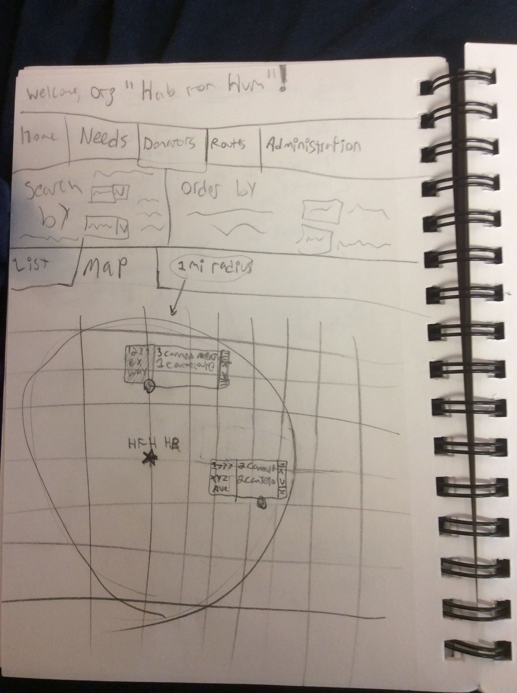
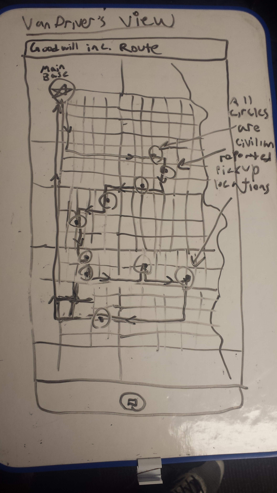
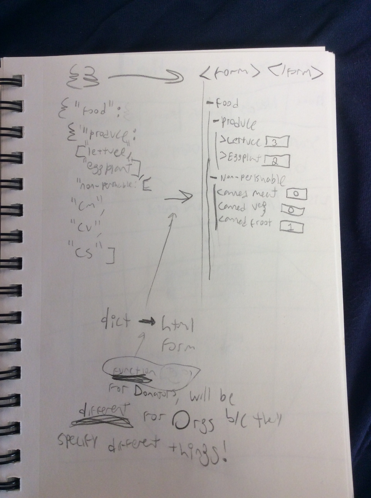
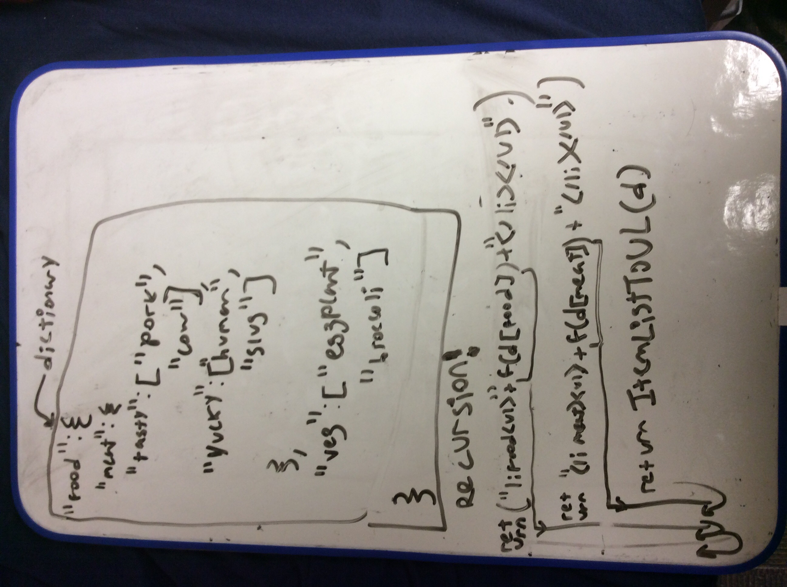

This is a listing of what the UI may look like, and of what it will/does look like.

<!-- TOC depthFrom:1 depthTo:6 withLinks:1 updateOnSave:1 orderedList:0 -->

- [Organization views](#organization-views)
	- [What does the Org need?](#what-does-the-org-need)
		- [Org Needs List view](#org-needs-list-view)
	- [What are people donating?](#what-are-people-donating)
		- [Org Donators List view](#org-donators-list-view)
		- [Org Donators Map view](#org-donators-map-view)
- [Driver views](#driver-views)
	- [Whilst driving 1](#whilst-driving-1)
- [Donator views](#donator-views)
	- [Donator Inventory View](#donator-inventory-view)
- [ER Diagrams](#er-diagrams)
	- [User-House-Items relationship](#user-house-items-relationship)
- [Miscellaneous views](#miscellaneous-views)
	- [Data JSON to HTML element](#data-json-to-html-element)
		- [What we need it to look like](#what-we-need-it-to-look-like)
		- [Recusive implementation](#recusive-implementation)

<!-- /TOC -->

# Screenshots

## Donator UI

--------------------------------------------------------------------------------

# Sketches

## Organization views

### What does the Org need?

#### Org Needs List view

### What are people donating?

#### Org Donators List view

#### Org Donators Map view

--------------------------------------------------------------------------------
## Driver views

### Whilst driving 1

--------------------------------------------------------------------------------
## Donator views

### Donator Inventory View

--------------------------------------------------------------------------------
## ER Diagrams

### User-House-Items relationship  

--------------------------------------------------------------------------------
## Miscellaneous views

### Data JSON to HTML element

#### What we need it to look like

#### Recusive implementation

