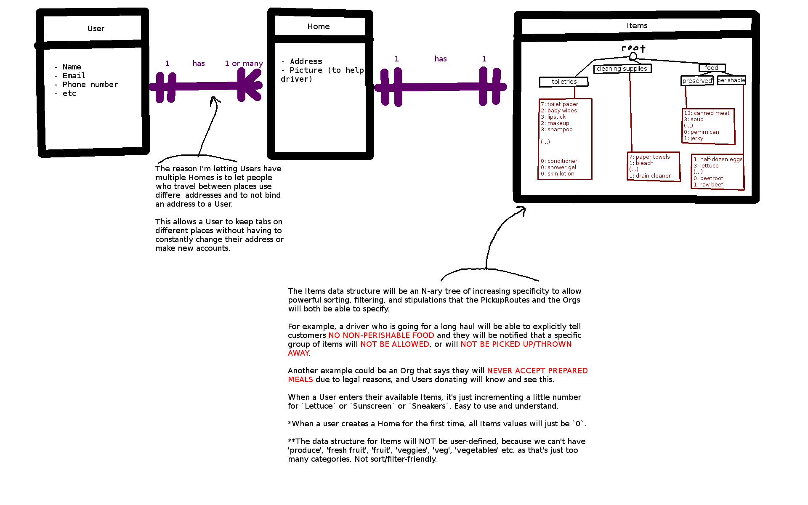

This is a listing of what the UI may look like.

<!-- TOC depthFrom:1 depthTo:6 withLinks:1 updateOnSave:1 orderedList:0 -->

- [Organization views](#organization-views)
- [Driver views](#driver-views)
	- [Whilst driving 1](#whilst-driving-1)
- [Donater views](#donater-views)
- [ER Diagrams](#er-diagrams)
	- [User-House-Items relationship](#user-house-items-relationship)

<!-- /TOC -->

# Organization views

TODO

# Driver views

## Whilst driving 1

# Donater views

TODO

# ER Diagrams

## User-House-Items relationship

